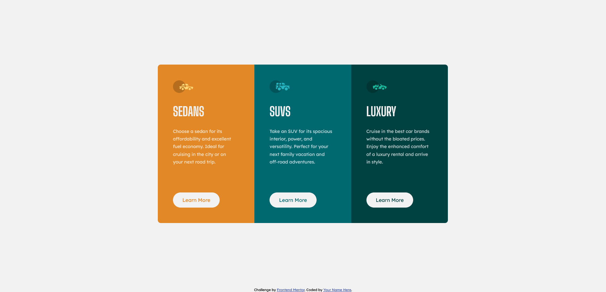

# Frontend Mentor - 3-column preview card component solution

This is a solution to the [3-column preview card component challenge on Frontend Mentor](https://www.frontendmentor.io/challenges/3column-preview-card-component-pH92eAR2-). Frontend Mentor challenges help you improve your coding skills by building realistic projects. 

## Table of contents

- [Overview](#overview)
  - [The challenge](#the-challenge)
  - [Screenshot](#screenshot)
  - [Links](#links)
- [My process](#my-process)
  - [Built with](#built-with)
  - [What I learned](#what-i-learned)
  - [Continued development](#continued-development)
  - [Useful resources](#useful-resources)
- [Author](#author)
- [Acknowledgments](#acknowledgments)

## Overview

### The challenge

Users should be able to:

- View the optimal layout depending on their device's screen size
- See hover states for interactive elements

### Screenshot



### Links

- Solution URL: [Add solution URL here](https://your-solution-url.com)
- Live Site URL: https://jaycgreenwald.github.io/3-column-preview-card-component/
- GitHub URL: https://github.com/jaycgreenwald/3-column-preview-card-component

## My process

- Same as before - start with mobile design. 
- Review Slack to see what feedback others have received about this project.
- Measure in Illustrator.
- Create class names
- Style CSS
- Test/compare with design
- Move on to desktop version and repeat
- Research topics as needed (such as using buttons vs. links).

### Built with

- Semantic HTML5 markup
- CSS custom properties
- Flexbox
- Mobile-first workflow

### What I learned

I used the :first-child and :last-child pseudo classes for the first time. I used this to apply a border-radius to the top and bottom sections of the card. I like this solution because it will continue to work if other vehicle types were added.

```css
.card__vehicle-type:first-child {
  border-top-left-radius: 9px;
    border-top-right-radius: 9px;
}
```

I also used modifiers for the first time with my BEM class names. Assuming I did it correctly, I like the outcome. 

```html
<section class="card__vehicle-type card__vehicle-type--dark-cyan">
  ```

  Lastly, I used flex-basis for the first time. I employed it to make each vehicle type section the same width.

  ```css
      .card__vehicle-type {
        flex-basis: 33.3%;
    }
  ```

### Continued development

- I need to continue to use Flexbox - getting a feel for it but still a long way to go.
- Looking to try out Grid soon too.
- Even more stuff I haven't even discovered yet!

### Useful resources

- [Buttons vs. Links](https://css-tricks.com/buttons-vs-links/) - I read somewhere that links were preferred over buttons, but wanted to learn more. I found this CSS-Tricks article. Straight and to the point.

## Author

- Website - [Jason Greenwald](https://github.com/jaycgreenwald)
- Frontend Mentor - [@jaycgreenwald](https://www.frontendmentor.io/profile/jaycgreenwald)
- Twitter - [@jaycgreenwald](https://www.twitter.com/jaycgreenwald)

## Acknowledgments

Hat tip to all of the fine people providing feedback on Slack. It is invaluable.